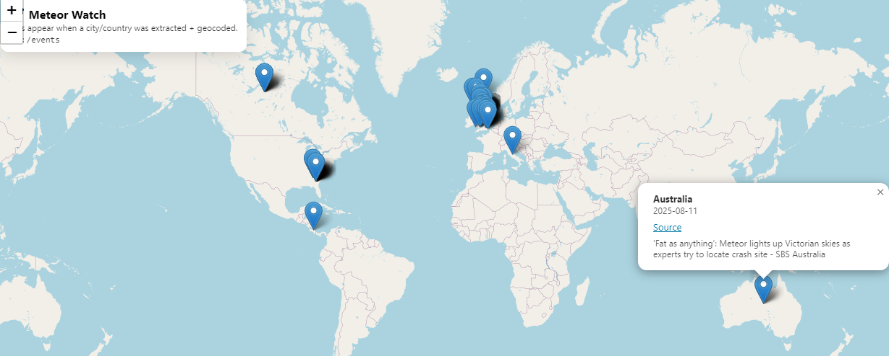
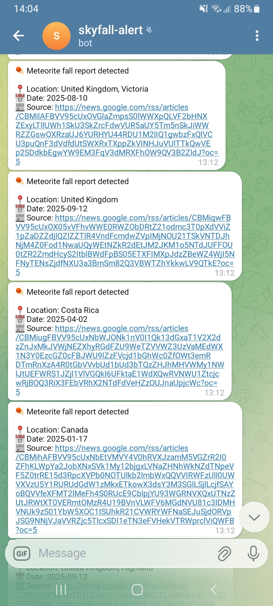

# skyfall-alert
Real-time alerts for astronomical impact events sourced from worldwide media.


# ☄️ Skyfall Alert

**Skyfall Alert** is a Python-based monitoring system that automatically scans global news sources for reports of **fallen meteorites**, sends **real-time Telegram notifications**, and visualizes detected events on an **interactive world map**.

---

## Features

* 🌍 Monitors global news (via Google News RSS)
* ☄️ Detects meteorite fall / impact reports
* 📍 Extracts location (country / city when possible)
* 🗺️ Displays events on an interactive world map
* 🤖 Sends Telegram notifications for new events
* 💾 Stores data locally (SQLite)
* 🐳 Runs fully in Docker (no local Python setup required)

---

## 🚀 Quick Start (Recommended: Docker)

### 1️⃣ Prerequisites

* **Docker Desktop** (Windows / macOS / Linux)
* **Git**
* **Telegram account**

## Telegram Setup Notes

1. Create a bot using **@BotFather**: 
    - In Telegram, search for: **@BotFather** — this is Telegram’s official bot for creating other bots.
    - Create a new bot: /newbot 
    - Copy the bot token. Save it somewhere safe — you’ll need it soon. 
2. Send a message to your bot (press **Start**):
    - Send any message (e.g. hi) — ⚠️ This step is required! If you don’t send a message, Telegram will not register the chat.
3. Get your `chat_id` via:

   ```
   https://api.telegram.org/bot<YOUR_TOKEN>/getUpdates
   ```

   Example:
   ```ruby
   https://api.telegram.org/bot123456789:AAAbbbCCCdddEEEfffGGG/getUpdates
   ```
4. Find the chat.id:
You will see a JSON response similar to:
```json
{
  "ok": true,
  "result": [
    {
      "message": {
        "chat": {
          "id": 123456789,
          "type": "private"
        }
      }
    }
  ]
}
```

You are ready to continue with setup.
They will be placed into the `.env` file later:

```env
TELEGRAM_BOT_TOKEN=your_token_here
TELEGRAM_CHAT_ID=your_chat_id_here
```
❗ Never commit this file to GitHub. 
<br>
<br>
You can safely proceed to:

---

### 2️⃣ Clone the repository

```bash
git clone https://github.com/Zauzanov/skyfall-alert.git
cd skyfall-alert
```

---

### 3️⃣ Create your environment file

Copy the example config:

```bash
copy .env.example .env     # Windows (PowerShell)
# or
cp .env.example .env       # macOS / Linux
```

Edit `.env` and set your values:

```env
TELEGRAM_BOT_TOKEN=your_bot_token_here
TELEGRAM_CHAT_ID=your_chat_id_here
```

❗ **Do not commit `.env`** — it contains secrets and is ignored by Git.

---

### 4️⃣ Start the system

```bash
docker compose up --build
```

This starts:

* `worker` is news scanner + Telegram notifier
* `api` is FastAPI backend + map UI

---

### 5️⃣ Open the map

* 🌍 **Map UI:** [http://localhost:8000/](http://localhost:8000/)
* 📡 **Events API:** [http://localhost:8000/events](http://localhost:8000/events)

Map Preview:


---

The bot will send messages like:
```
☄️ Meteorite fall report detected

📍 Location: Norway, Oslo
📅 Date: 2026-02-02
📰 Source: https://news.example.com/...
```
Message Preview:<br>


---

## 🗺️ Interactive Map

* Built with **Leaflet**
* Shows detected meteorite locations as markers
* Click a marker to view:

  * location
  * date
  * article title
  * source link

If no markers appear initially, the database may simply be empty — this is normal.

---

## Project Structure

```
skyfall-alert/
├─ app/                # Python backend & worker
│  ├─ api.py           # FastAPI app
│  ├─ pipeline.py      # News scanning worker
│  ├─ db.py            # SQLite storage
│  └─ ...
├─ static/             # Map UI (HTML + JS)
├─ data/               # SQLite database (ignored by Git)
├─ docker-compose.yml
├─ Dockerfile
├─ .env.example
└─ README.md
```

---

## First Run Behavior (Important!)

On the **first run**, the database is empty.

This means:

* All matching articles found in RSS feeds are considered “new”
* You may receive **many Telegram messages at once**, including older articles

This is **expected behavior**.

After the first run:

* All previously seen articles are stored
* Only **newly published** reports trigger notifications

---

## Testing & Debugging

### Send a test Telegram message

```bash
docker compose exec worker python -c "from app.telegram_notify import send_telegram_message as s; s('✅ Skyfall Alert test message')"
```

### Insert a test event for the map

```bash
docker compose exec worker python -c "from app.db import init_db, insert_event; from datetime import datetime, timezone; init_db(); insert_event({'title':'Test event','source_url':'https://example.com/test','published_at':'2026-02-02','detected_at':datetime.now(timezone.utc).isoformat(),'country':'Norway','region':'Oslo','city':'Oslo','latitude':59.9139,'longitude':10.7522,'raw_location_text':'Oslo, Norway'})"
```

Refresh the map — a marker should appear.

---

## 🛑 Stopping the System

Press **Ctrl + C** in the terminal running Docker.

Data is preserved in `data/app.db`.

---

## 🔐 Security Notes

* `.env` is ignored by Git via `.gitignore`
* Never commit bot tokens or secrets
* For CI/CD, use **GitHub Secrets**

---

## Planned Improvements

* Reduce false positives with confidence scoring
* Ignore historical articles on first run
* Telegram commands (`/latest`, `/stats`)
* Map filters and clustering
* Additional news sources

---

## 📜 License

MIT License © Taulan Zauzanov

---

If you find it interesting or build on it — feel free to fork, improve, and experiment ☄️


